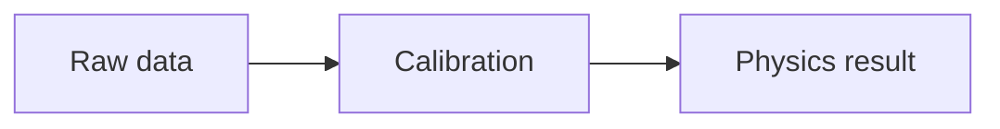

# Media and diagrams

Use fenced media blocks when you need sizing, fitting, alignment, captions, or animation. Ordinary Markdown images remain useful for simple cases.

## Image blocks

````markdown
```image
src: ./assets/jpsi/jpsi_discovery_mass_spectrum.png
alt: Original dielectron mass spectrum showing the J peak
width: 70%
height: auto
max-height: 60vh
fit: contain
align: center
caption: Original 1974 dielectron mass spectrum
```
````

Key controls:

| Setting                   | Purpose                                              |
| ------------------------- | ---------------------------------------------------- |
| `src`                     | Local or remote image source                         |
| `alt`                     | Accessible description                               |
| `width`, `height`         | CSS size, including `%`, `px`, `vw`, `vh`, or `auto` |
| `max-width`, `max-height` | Upper size limit                                     |
| `fit`                     | `contain`, `cover`, `fill`, `none`, or `scale-down`  |
| `align`                   | `left`, `center`, or `right`                         |
| `caption`                 | Simple caption below the image                       |

The compact Markdown form has no size fields:

```markdown

```

Convert it to an `image` block when size or fit must be controlled.

## PDF blocks

Embed a page from a local or remote PDF:

````markdown
```pdf
src: ./assets/results/fit.pdf
page: 1
width: 70%
height: 58vh
caption: Background fit in the sideband region
caption-size: 28px
caption-color: #244a3a
caption-align: center
caption-position: bottom
caption-gap: .65rem
caption-offset-x: 0px
caption-offset-y: 10px
```
````

PDF size is controlled with `width` and `height`. Percentage width is relative
to the block's column; `100vw` is relative to the browser and is usually
inappropriate inside a slide. Omit `height` to use NeoPresent's fitted slide
height, or use `@scale` immediately before the block when the entire PDF figure
and caption should scale together.

PDF captions support `caption-size`, `caption-color`, `caption-alpha`,
`caption-font`, `caption-align`, `caption-position` (`top` or `bottom`),
`caption-gap`, `caption-offset-x`, and `caption-offset-y`. Caption text supports
inline styles and math.

Local PDF figures are rendered as normal slide content in live mode. During PDF export they are converted to SVG when possible so paths, text, clipping, and glyphs remain vector content. Transparent PDF pages retain their transparency.

When several PDF figures appear in one slide or in replacement states, each document keeps independent internal SVG identifiers so fonts, masks, and clipping paths do not collide.

## Audience PDF inspection mode

Press `P` to inspect the original PDFs used on the current audience slide. Inspection uses the viewer window's own dimensions, fits each PDF to the available width, and provides vertical scrolling for the full page. The presenter displays a floating remote toolbar above the current-slide preview so PDF inspection can still be controlled without moving the pointer to the audience window.

Presenter PDF controls:

| Input                     | Action                           |
| ------------------------- | -------------------------------- |
| `P`                       | Enter or leave PDF inspection    |
| `+` / `-`                 | Zoom in / out                    |
| `=` or `R`                | Fit to the viewer                |
| Arrow keys                | Scroll the inspected PDF         |
| `Shift+Up` / `Shift+Down` | Previous / next PDF on the slide |
| Page Up / Page Down       | Previous / next PDF on the slide |

PDF inspection is a live viewing aid and is not used as the export layout.

## Video and audio

Video/audio block controls are `src`, `autoplay`, `loop`, `muted`, and
`controls`; video also accepts `poster`. Use an outer `@scale` or other block
layout directive when the rendered media block needs different sizing. Browser
autoplay policies generally require muted video until the user interacts with
the page.

Keep media files inside the presentation directory so they resolve from the same project root when served or exported.

## Web embeds and runnable JavaScript

Web embeds display external content in an iframe. They depend on the target site's iframe and security policy and may not work offline. Runnable JavaScript is intended for small local demonstrations; keep long computation and external dependencies out of the slide render path.

## Mermaid

Use a fenced Mermaid block for flowcharts and other Mermaid-supported diagrams:

````markdown

````

## Feynman diagrams

Feynman blocks define vertices and edges in normalized coordinates:

````markdown
```feynman
width: 1200
height: 420
background: transparent
color: #111111
line-width: 3
animation: draw
animation-order: right-to-left

vertex: annihilation | x: .45 | y: .50 | size: 10
vertex: decay | x: .65 | y: .50 | size: 10
vertex: lepton-plus | x: .92 | y: .20 | label: $\ell^+$ | visible: false
vertex: lepton-minus | x: .92 | y: .80 | label: $\ell^-$ | visible: false

edge: annihilation -> decay | type: photon | label: $\gamma^*/Z$
edge: lepton-plus -> decay | type: fermion | color: #00aa00
edge: decay -> lepton-minus | type: fermion | color: #00aa00
```
````

Edges support fermion, photon, gluon, scalar, arrow, line width/color, labels, label offsets, and arrow placement. Vertices support position, visible marker size/color, labels, label offsets, and label size.

For staged diagram navigation, set `animation-trigger: reveal`, `reveal-stages`, and `reveal-stage` on individual vertices/edges. See [Animation](animations.md). Use `export-stages: false` only when live stages should remain but `--steps` export should contain the final diagram once.

## Standard Model and periodic table

Built-in scientific diagrams use the `plot` fence:

````markdown
```plot
type: standard-model
diagram-tooltips: true
```
````

Highlight named regions with staged entries:

```text
diagram-highlight: generation-I | label: First generation | duration: 2s | dim-alpha: 0.50 | stage: 1
diagram-highlight: generation-II | label: Second generation | duration: 2s | dim-alpha: 0.50 | stage: 2
diagram-highlight: force-bosons | label: Force bosons | duration: 2s | dim-alpha: 0.50 | stage: 3
```

The Standard Model diagram includes quark color overlays, force carriers, Higgs, graviton, and coupling constants. The periodic-table diagram uses the same highlight-stage model. With `animation-trigger: reveal`, stage navigation is confined to the diagram block and does not consume unrelated list reveals.

Detailed staged behavior and export are covered in [Animation](animations.md) and [Exporting](exporting.md).

For every Feynman diagram-, vertex-, edge-, momentum-, animation-, and reveal
field, see [Feynman settings](settings-reference.md#feynman-settings). Every
Standard Model and periodic-table plot key is listed under
[Scientific diagrams](plot-settings-reference.md#scientific-diagrams).
